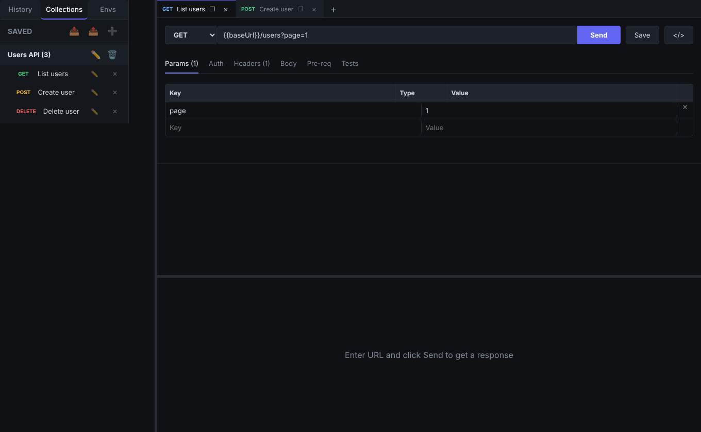
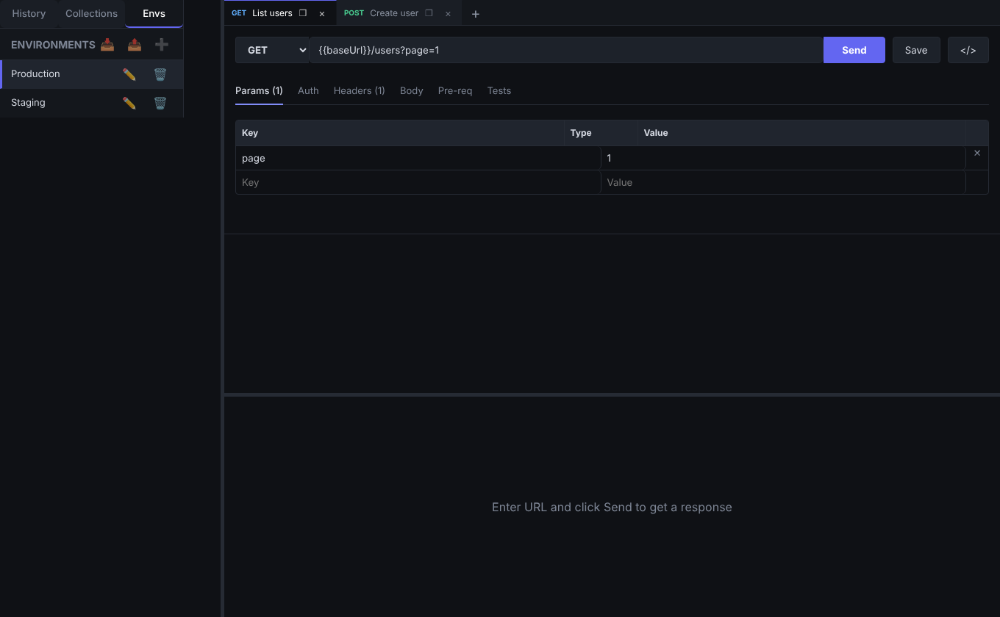
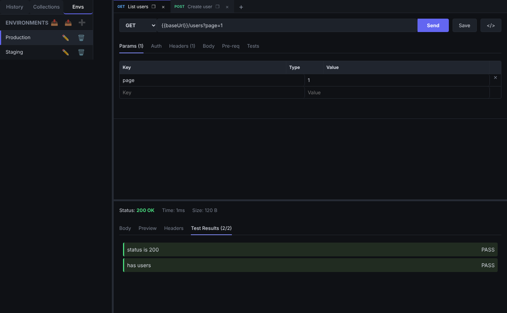
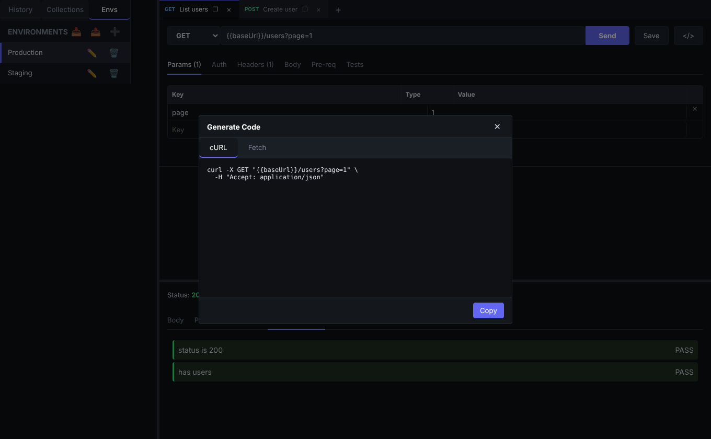

<p align="center">
  
</p>

<p align="center">
  
  
  
  
</p>

<p align="center">
  Cliente de API desktop no estilo Postman: pequeno, rápido e sem Chromium embutido.
</p>

---

## ✨ Visão geral

<p align="center">
  
</p>

## 🚀 Recursos

| | |
|---|---|
| 🗂️ **Abas persistentes** | Suas requisições abertas voltam do jeito que você deixou |
| 🌍 **Ambientes** | Variáveis `{{baseUrl}}` com troca rápida entre Production, Staging... |
| 📚 **Coleções e histórico** | Salve, organize, importe e exporte |
| 🔐 **Autenticação** | Bearer, Basic e API Key (header ou query) |
| 📦 **Body completo** | JSON/texto, form-data (com arquivos) e x-www-form-urlencoded |
| 🧪 **Scripts e testes** | Pre-request e testes com API `pm` (`pm.test`, `pm.expect`, `pm.environment`, `pm.response`) |
| 🔎 **Resposta** | Body formatado, preview, headers e resultados dos testes; copiar e baixar |
| 🧩 **Gerador de código** | cURL e fetch a partir da requisição atual |
| ⛔ **Cancelamento** | Interrompa requisições em andamento |

## 🖼️ Telas

<table>
  <tr>
    <td align="center"><b>Coleções</b><br></td>
    <td align="center"><b>Ambientes</b><br></td>
  </tr>
  <tr>
    <td align="center"><b>Testes automatizados</b><br></td>
    <td align="center"><b>Gerador de código</b><br></td>
  </tr>
</table>

## 🦀 Por que Tauri

O app usa a webview do sistema e um backend Rust (`reqwest`, com pool de conexões, gzip/brotli e timeouts).
Resultado: instalador pequeno e baixo consumo de memória, sem Node ou Chromium embutidos.

## 🛠️ Desenvolvimento

Requisitos: Node 20+, Rust estável e os [pré-requisitos do Tauri](https://tauri.app/start/prerequisites/).

```bash
npm install
npm run tauri:dev     # app desktop com hot reload
npm run dev           # somente a UI no navegador (sem backend nativo)
npm test              # testes (vitest)
npm run tauri:build   # gera o instalador
```

## 🧱 Estrutura

```
src/renderer/           UI React (componentes, store MobX, utilitários)
src/renderer/api/       ponte com o backend (invoke) e sandbox de scripts `pm`
src-tauri/src/http.rs   execução HTTP e cancelamento (Rust)
docs/                   banner e screenshots
```

## 📄 Licença

ISC
