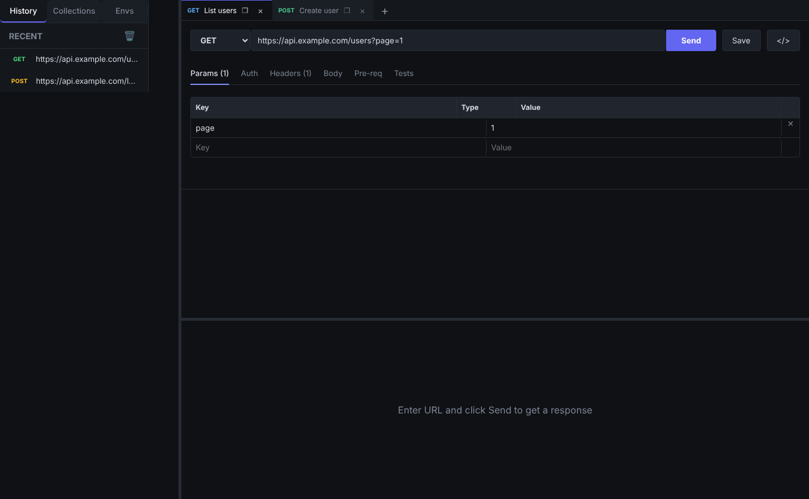
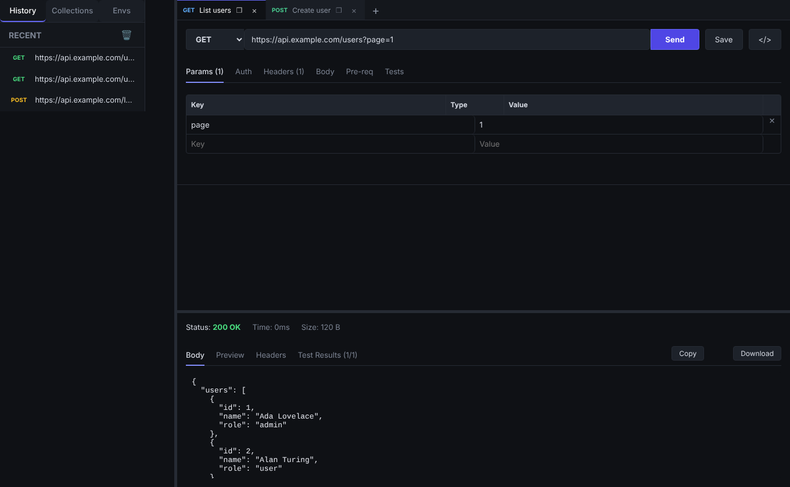

# PingHermano

Cliente de API leve e rápido (estilo Postman), construído com **Tauri 2** (Rust) + **React** + **MobX**.




## Recursos

- Abas de requisição persistentes, histórico, coleções e ambientes (`{{variavel}}`)
- Métodos HTTP, headers, query params, body (texto/JSON, form-data com arquivos, urlencoded)
- Autenticação (Bearer, Basic, API Key)
- Scripts de pre-request e testes com API `pm` (`pm.test`, `pm.expect`, `pm.environment`, `pm.response`)
- Visualização da resposta (body, preview, headers, testes), copiar/baixar
- Gerador de código (cURL e fetch), import/export de coleções e ambientes
- Cancelamento de requisições em andamento

## Por que Tauri

Instalador pequeno e baixo consumo de memória: o app usa a webview do sistema e um backend Rust
(`reqwest`, com pool de conexões, gzip/brotli e timeouts), sem Chromium/Node embutidos.

## Desenvolvimento

Requisitos: Node 20+, Rust estável e as [dependências do Tauri](https://tauri.app/start/prerequisites/).

```bash
npm install
npm run tauri:dev     # app desktop com hot reload
npm run dev           # somente a UI no navegador (sem backend nativo)
npm test              # testes (vitest)
npm run tauri:build   # gera o instalador
```

## Estrutura

```
src/renderer/        UI React (componentes, store MobX, utilitários)
src/renderer/api/    ponte com o backend (invoke) e sandbox de scripts `pm`
src-tauri/src/http.rs  execução HTTP e cancelamento (Rust)
```

## Licença

ISC
